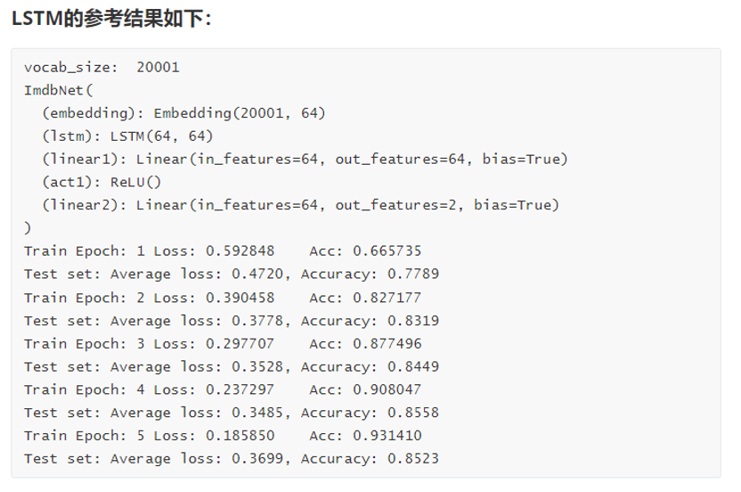

# Homework 5: 循环神经网络

## 作业 1: LSTM RNN GRU 对比试验

### 1.1 任务介绍

本作业目的是引导同学们阅读PyTorch中的文档，以理解RNN的使用方式和性能对比.

### 1.2 任务描述

1. 阅读Pytorch内置的[Recurrent Layers](https://pytorch.org/docs/stable/nn.html#recurrent-layers)的官方文档（包括LSTM，RNN，GRU），了解不同的Recurrent Layers的输入和输出结构，以及初始化参数的含义。请在实验报告当中任意挑选一种，简单介绍它的输入输出的格式、以及初始化参数的含义。
2. 修改 `example_imdb_lstm_torch.py` 中的 `ImdbNet` 类的 `self.lstm` 为上述三种内置的Layer（LSTM，RNN，GRU；其中原始代码中已经填充了LSTM），运行代码并在实验报告当中汇报结果，结果格式请参考下面的“LSTM的参考结果”

  

> PS: 尽管目前生成式人工智能十分发达, 但阅读文档仍是编程学习无法绕开的一部分. 在文档中往往会包含更详细的API使用说明, 使用示例以及可能问题. 因而建议同学们借此机会, 逐步养成查阅文档的习惯. 
> 此外, 在一些不断发展的代码库中, 阅读 Github 上的 issues(前人们踩的坑) 会对 coding and debugging 帮助很大.

### 1.3 提交要求

在实验报告中需包括上述任务和以下内容:

1. 任选一种Recurrent Layers的介绍（1分）
2. LSTM RNN GRU 对比实验的实验结果（2分）

## 作业 2: 手写 LSTM 实验

### 2.1 任务介绍

本作业目的是让同学们了解LSTM的实现细节。

### 2.2 任务描述

1. 在不使用`nn.LSTM`的情况下，从原理上实现LSTM。你可以参考PPT或者Pytorch官方文档[LSTM — PyTorch 2.2 documentation](https://pytorch.org/docs/stable/generated/torch.nn.LSTM.html#torch.nn.LSTM)来完成这个任务。
2. 训练后测试集准确率要求不低于80% ，你需要在实验报告当中汇报结果，结果的格式请参考上面的“**LSTM的参考结果**”（2分），我们会检查代码实现的正确性（2分）
3. 调整网络结构（例如网络隐藏层维度，1分）、损失函数（其它的损失函数可以参考Pytorch的官方文档[torch.nn#loss-functions](https://pytorch.org/docs/stable/nn.html#loss-functions)，1分）、训练流程（例如训练的超参数，epoch、batchsize等，1分），观察他们对训练效果的影响。

> **注: 80%的准确率仅要求最优结果。在调整网络结构、损失函数、训练流程当中，不要求达到80%准确率。**

### 2.3 提交要求

在实验报告中包括上述任务及以下内容:

1. 超过80%实验结果的截图（2分）
2. 调整三个不同内容的结果截图（3分）
3. 内容包括整个作业包，其中必须包括手写LSTM的代码（正确实现，2分）。

> - **如果你的设备没有GPU，建议使用Google Colab进行训练，Colab提供免费的GPU资源(尽管不太稳定).**
> - **Question: How to use Colab? Ans: Just Google it!**
> - 在 `pack.py` 中填写组号, 姓名与学号, 在完成所有内容后运行 `python pack.py` 打包文件, 提交得到压缩文件即可. (注, `pack.py` 在压缩时会跳过 `__pycache__` 文件夹, `data/` 文件夹 和 路径里的 `.zip` 文件.)
> - Good luck! 